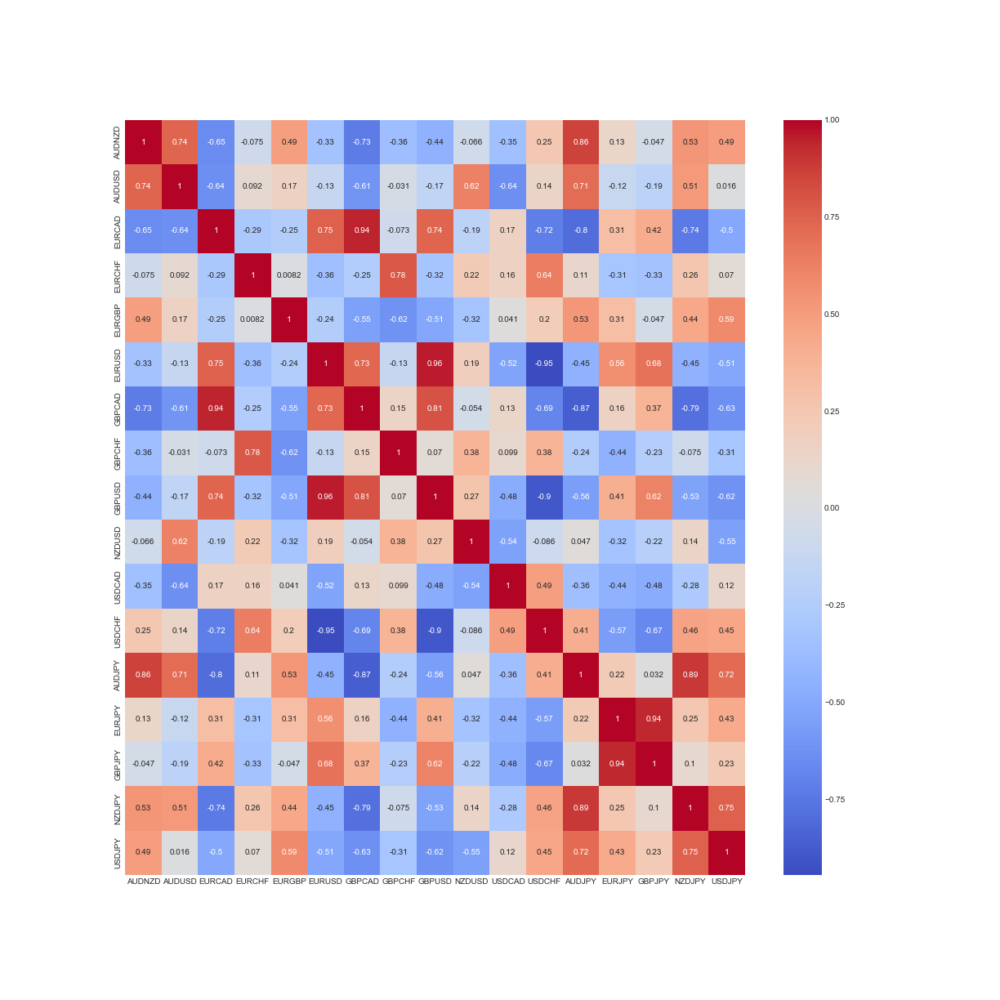

# Forex Correlation Matrix

Forex trading involves buying and selling currencies to make a profit in the largest financial market in the world. Traders use various methods to analyze the market, including technical and fundamental analysis, news events, and economic data. Analyzing currency correlations is a crucial aspect of Forex trading, as it enables traders to identify patterns and trends that can help them develop trading strategies and manage risk.

The Forex Correlation Matrix script is a tool designed to help Forex traders and investors analyze the correlation between different currency pairs. The script retrieves historical data using the tvDatafeed package and calculates the correlation matrix between selected pairs. The output of the script is a heatmap visualization of the correlation matrix, which can be used to identify patterns and trends between pairs. The tool is customizable, allowing users to select the pairs and time period they wish to analyze. By using this tool, traders and investors can make informed trading decisions by developing trading strategies and managing risk based on the correlations between currency pairs.

---

## Requirements
The following packages are required to run this script:

    streamlit
    pandas
    numpy
    tvDatafeed
    matplotlib
    datetime
    seaborn
    You can install these packages using pip.

---

## Usage
To use this script as a Streamlit app, follow these steps:

- Install the required packages by running pip install -r requirements.txt in your command line or terminal.

- Run the app by running streamlit run forex_correlation_app.py.

- Once the app is running, select the currency pairs you wish to analyze and the time period you are interested in using the dropdown menus.

- The app will automatically retrieve historical data for the selected pairs and time period, calculate the daily returns for each pair, and generate a heatmap visualization of the correlation matrix.

- Use the heatmap to identify patterns and trends between the selected pairs that can be used to develop trading strategies and manage risk.

---

## Output
The output of this app is a heatmap visualization of the correlation matrix between the selected currency pairs and time period.

The heatmap shows the strength and direction of the correlation between each pair. Positive values indicate a positive correlation (i.e. the pairs tend to move in the same direction), while negative values indicate a negative correlation (i.e. the pairs tend to move in opposite directions). The darker the color, the stronger the correlation.

---

## Notes

- This script retrieves data using the tvDatafeed package, which requires an API key. You will need to provide your own API key in order to use this package.

- This script retrieves data for a fixed number of bars (5000). You can adjust this number to retrieve more or less data as needed.

- This script adds a delay of 0.5 seconds between each request to avoid overwhelming the API. You can adjust this delay as needed.

- This script drops any rows with missing data (i.e. when the market is closed). If you want to keep these rows, you can comment out the dropna() line.